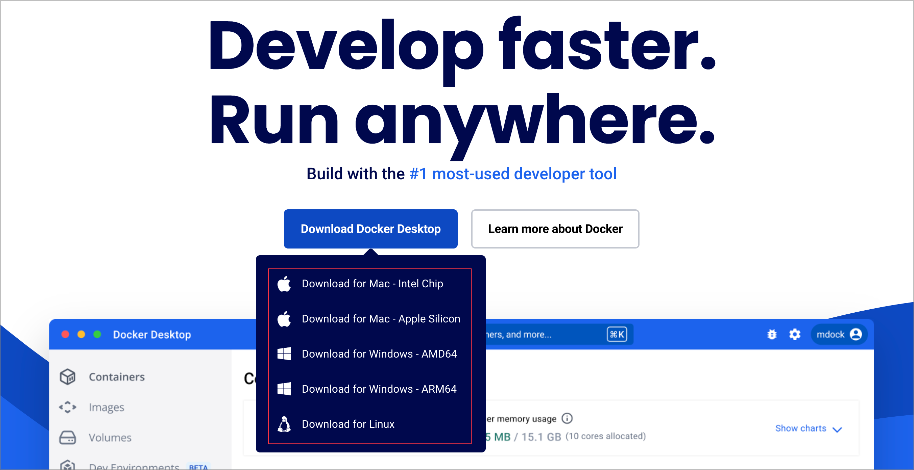

## 安装[Docker](https://www.docker.com/)

- 打开[Docker官网](https://www.docker.com/)，下载对应系统版本

  

  下载后安装,之后打开Docker Desktop，等待Docker 正常运行。

- 使用命令行安装

  - Window

    ```powershell
    winget install Docker.DockerDesktop
    ```

  - Macos

    ```shell
    brew install docker --cask
    ```

    或者

    ```shell
    brew install orbstack --cask
    ```

    

  - Linux

    ```shell
    curl -fsSL https://get.docker.com | bash -s docker
    sudo systemctl start docker
    sudo systemctl enable docker.service
    ```


## 配置LND

1. 选择或者创建为lnd节点存储数据的文件夹

   ```shell
   mkdir ./lnd 
   ```

   

2. 创建配置文件`lnd.conf`，可以建议使用当前的 `lnd.conf.example`

    ```shell
    cp ./lnd.conf.example ./lnd/lnd.conf
    # Or
    vim ./lnd/lnd.conf
    ```

    如果你有自己的BTC全节点的话，可以替换`bitcoin.node`设置为 `btcd` 或者 `bitcoind`

    需要对应的修改`[neutrino]` 

    - btcd

      ``` ini
      [btcd]
      btcd.rpchost=
      btcd.rpcuser=
      btcd.rpcpass=
      btcd.rawrpccert=
      btcd.rpccert=
      ```

      

    - bitcoind

      ``` ini
      [Bitcoind]
      bitcoind.rpchost=
      bitcoind.rpcuser=
      bitcoind.rpcpass=
      bitcoind.rpcpolling=true
      ```

    > **注意**：如果替换`bitcoin.node` 为全节点 `btcd` 或者 `bitcoind` 且未设置远程节点信息，lnd将在内部启动一个全节点同步，这将会花费很长的时间和占用较大的存储盘资源

    

    如果没有全节点，可以使用`lnd.conf.mainnet.example`中设置的`neutrino` 轻节点，lnd会自动同步数据（大概10分钟）, 使用`neutrino`之类轻节点时，建议适量增加addpeer对等节点，加快同步速度，目前`lnd.conf.mainnet.example`中已有推荐

    ``` ini
        [Application Options]
        debuglevel=trace
        maxpendingchannels=10
        alias=Bevm_client_test
        no-macaroons=false
        coin-selection-strategy=largest
        rpclisten=localhost:10009
        restlisten=localhost:8080
        no-rest-tls=true
        restcors=https://bevmhub.bevm.io
        
        [prometheus]
        prometheus.listen=[::]:8989
        
        [Bitcoin]
        bitcoin.mainnet=true
        bitcoin.node=neutrino
        
        [neutrino]
        neutrino.addpeer=btcd-mainnet.lightning.computer
        neutrino.addpeer=neutrino.noderunner.wtf
        neutrino.addpeer=node.eldamar.icu
        neutrino.addpeer=btcd.lnolymp.us
        neutrino.addpeer=btcd0.lightning.engineering
        neutrino.addpeer=bb1.breez.technology:8333
        neutrino.addpeer=node.blixtwallet.com:8333
        neutrino.addpeer=mainnet1-btcd.zaphq.io
        neutrino.addpeer=mainnet2-btcd.zaphq.io
        neutrino.addpeer=mainnet3-btcd.zaphq.io
        neutrino.addpeer=mainnet4-btcd.zaphq.io
        
        [protocol]
        protocol.simple-taproot-chans=true
        
        [fee]
        fee.url=https://nodes.lightning.computer/fees/v1/btc-fee-estimates.json
    ```

## 运行LND

> **注意**: 以下docker 命令执行都需要在lnd文件夹上层目录执行，或者自行修改docker run命令中的路径`./lnd`到对应绝对路径

```shell
docker run --name lnd --rm -d --network host -v ./lnd:/root/.lnd lightninglabs/lnd:v0.18.5-beta
```

此时未创建钱包，如果使用了`bitcoin.node=neutrino` 配置，lnd节点会开始运行`neutrino` 轻节点，并开始同步数据，同步数据需要一点时间，同步期间无法使用钱包功能
可以通过一下命令查看当前同步情况和同步块高详情

```shell
# 同步详情
docker exec -it lnd lncli --network mainnet getinfo
# 同步块高数
docker exec -it lnd lncli --network mainnet getinfo | grep block_height
```

## 创建钱包

```shell
docker exec -it lnd lncli create
```

根据提示输入密码(输入密码不会显示)

```shell
Input wallet password:
Confirm password:
```

如果已有钱包可以根据`y`或者`x`导入钱包，如果没有钱包可以输入`n`创建新钱包

``` shell
Do you have an existing cipher seed mnemonic or extended master root key you want to use?
Enter 'y' to use an existing cipher seed mnemonic, 'x' to use an extended master root key
or 'n' to create a new seed (Enter y/x/n):
```

一般助记词部分的密码是空，直接回车

```shell
Your cipher seed can optionally be encrypted.
Input your passphrase if you wish to encrypt it (or press enter to proceed without a cipher seed passphrase):
Confirm password:
```

如果是创建新钱包，记得在此步骤记住当前助记词

```shell
Generating fresh cipher seed...

!!!YOU MUST WRITE DOWN THIS SEED TO BE ABLE TO RESTORE THE WALLET!!!

---------------BEGIN LND CIPHER SEED---------------
xxxxxxxxxxxxxxxxxxxxxxxxxxxxxxxxxxxxxxxxxxxxxxxxxx
xxxxxxxxxxxxxxxxxxxxxxxxxxxxxxxxxxxxxxxxxxxxxxxxxx
xxxxxxxxxxxxxxxxxxxxxxxxxxxxxxxxxxxxxxxxxxxxxxxxxx
xxxxxxxxxxxxxxxxxxxxxxxxxxxxxxxxxxxxxxxxxxxxxxxxxx
xxxxxxxxxxxxxxxxxxxxxxxxxxxxxxxxxxxxxxxxxxxxxxxxxx
xxxxxxxxxxxxxxxxxxxxxxxxxxxxxxxxxxxxxxxxxxxxxxxxxx
---------------END LND CIPHER SEED-----------------

!!!YOU MUST WRITE DOWN THIS SEED TO BE ABLE TO RESTORE THE WALLET!!!

lnd successfully initialized!
```


## 完成

到此节点创建和运行已经完成，认证使用的admin.macaroon在当前文件夹的`./lnd/data/chain/bitcoin/{network}/admin.macaroon`
节点rpc地址为`lnd.conf`中的`restlisten`地址

## 常见问题

### 如何停止`LND`节点，如何重启节点

```shell
# 停止节点
docker stop lnd

# 重启节点
docker run --name lnd --rm -d --network host -v ./lnd:/root/.lnd lightninglabs/lnd:v0.18.5-beta
```

### 重启节点或者第一次运行连接钱包时遇到`wallet locked, unlock it to enable full RPC access`错误
每次重新运行`LND`节点需要重新`unlock`钱包，需要运行以下命令

```shell
docker exec -it lnd lncli unlock
```

### `LND`节点的数据和通道数据都在哪里，是否会因为节点暂停而自动清除
节点数据和通道数据都在`./lnd`文件夹下，包含`admin.macarron`文件等，该文件不会随着Docker中`LND`节点的暂停而清除，当然请妥善保管改文件夹，如果不小心删除，将导致资产损失

